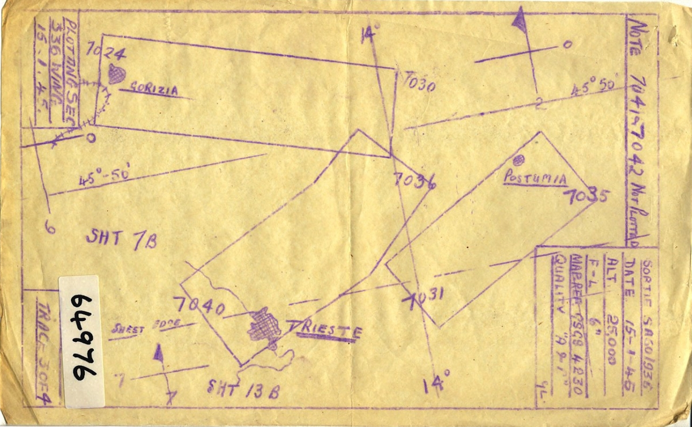
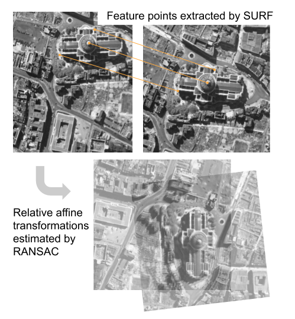
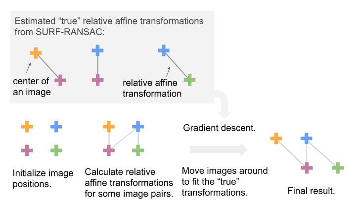

# Stitching Historical Aerial Photos

 [](https://zenodo.org/badge/latestdoi/290566410)

## The Story

In a centuries-old library at the University of Oxford, millions of aerial photographs taken in the final decades of the British Empire may help us prepare for a potential 21st-century calamity: an exodus of people driven by climate change to places that are more livable — but politically inhospitable.

Our team is studying how climate change might set off mass migrations around the world, and looking back to history for inspiration. These century-old photos, some of which taken by the British Royal Air Force, are key to this analysis because they could reveal how populations responded to natural disasters in the past — specifically, a series of extreme droughts that plagued Africa, and hurricanes that wreaked havoc in the Caribbean islands. There were such little census or survey data back then, and the earliest record of satellite images started only in the 1970s. Apart from these boxes and boxes of black-and-white photos, scholars trying to study historical mass migrations have almost nothing to work with; but now, with modern computer vision and machine learning techniques, we can paint a complete picture of human settlement patterns and how they respond to extreme weather events.

One of the first challenges in working with historical aerial photos is that it is difficult to georeference them (assigning the images to the geographical location that they cover). Unlike modern satellite imagery, historical images are not georeferenced at the time when they are collected, and the ways that experts record their locations can be pretty crude. Usually, they roughly outline the areas that the aerial photos cover by hand, and mark the image identifier numbers on them. As you can imagine, these hand-drawn maps tend to be inaccurate, and more importantly, georeferencing aerial photos solely based on hand-drawn maps is labor-intensive and quickly becomes impossible as the number of aerial photos grows. Other commercially available software such as Photoshop and OpenCV succeeded in automatically stitching a small number of images (<100), but failed miserably when scaled up.

__Figure__: An example sortie plot. _Source: [NCAP](https://ncap.org.uk/sites/default/files/NCAP_ACIU_PLOT_64976-3.jpg)._



In this project, I led a research team to develop an efficient and scalable data pipeline to digitize, process, stitch and georeference historical aerial photos; extract building footprints and road networks with deep learning models; and trace the changes in human settlement patterns over time. This repo contains codes for the image stitching process.

## The Idea

We break this problem down to two steps -

1. Given a pair of two images that overlap with each other, how do we overlay them? We take advantage of established methods in the computer vision literature - using SURF to detect features and RANSAC to estimate transformations from matched feature points robustly. These techniques were originally developed for panorama image stitching and work well in our context. This part of the codes is implemented mostly with `opencv`.



2. If we see all the images of interest as a graph (with each node being an image, and each edge being a relative transformation between a pair of images), how do we go from a collection of pairwise relationships to the absolute positions of all the images? We develop a "joint optimization" routine, which creates a differentiable loss given all the pairwise matches that are available, and uses back propagation to compute gradients and optimizes with Adam. This part of the codes is implemented mostly with `pytorch`. (No GPUs required for running the codes.)



_Source of the demo image: [Historical England](https://historicengland.org.uk/media/5589/london-st-pauls-vertical-1948-raf_58_40_5069-00.jpg?mode=max&quality=90&width=1200&height=1200&upscale=false&rnd=131817426560000000)._

## Play with our `demo.ipynb`!

In this repo, we release a simplified version of our core codebase. For legal reasons, we cannot share raw historical photos or sortie plots publicly; so we provide a "toy example" for demonstration. In practice, our codebase can handle complex scenes with tens of thousands of images. Play with our interactive demo in `demo.ipynb`! You can change the initialization positions for all the images, but they will always find their way back to each other.

To play with our demo, run

```
docker pull luna983/stitch-aerial-photos:latest
docker run -p 8888:8888 luna983/stitch-aerial-photos:latest
```

go to `http://localhost:8888/?token=[REPLACE WITH TOKEN SHOWN]` in a web browser, and open up `demo.ipynb` to start exploring!


Note that the SURF functions are not included in the free OpenCV distributions (so `pip install opencv-python` would not be sufficient); the docker image contains a version of OpenCV compiled specifically for that environment.
